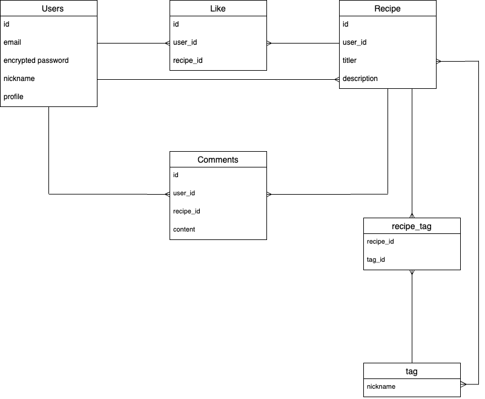
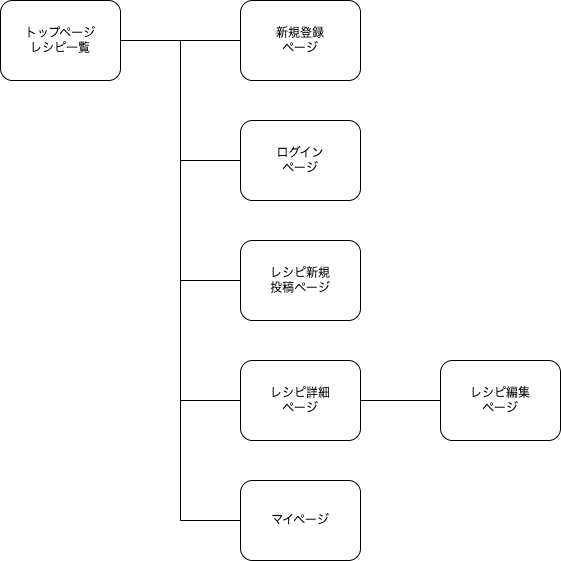

# Child Recipe

子供向けおやつレシピ共有アプリケーション

## 概要
このアプリケーションは、子供向けのおやつレシピを共有・管理するためのWebアプリケーションです。ユーザーはレシピを投稿し、他のユーザーのレシピにコメントやいいねを付けることができます。

## URL
https://child-recipe.onrender.com

## テスト用アカウント
- Basic認証ID: sugita3549
- Basic認証パスワード: 1265
- メールアドレス: test.2025@test.com
- パスワード: sample123

## 利用方法
- レシピ投稿・編集・削除  
1.トップページ(一覧ページ)のヘッダーからユーザー登録をします。  
2.新しいレシピ投稿ボタンから、レシピタイトル、レシピ詳細、レシピ画像、タグを入力してレシピ投稿します。  
3.レシピカードの詳細を見るボタンから、詳細ページに遷移します。  
4.編集ボタンを押すと編集ページに遷移し、変更したいレシピタイトル、レシピ詳細、レシピ画像、タグを編集した後、おやつレシピを更新ボタンを押すと
  レシピを更新(編集)できます。  
5.詳細ページの削除ボタンから、レシピを削除できます。

- レシピ検索  
1.トップページ(一覧ページ)の検索フォームにキーワードを入力し、検索ボタンを押すと、キーワード関連のレシピが一覧に表示されます。

- コメント投稿  
1.レシピカードの詳細を見るボタンから、詳細ページに遷移します。  
2.コメントフォームにコメントを入力し、コメント投稿ボタンを押すと、コメント一覧に表示されます。

- いいね機能  
1.レシピカードの詳細を見るボタンから、詳細ページに遷移します。  
2.詳細ページのいいねボタンを押すといいねできます。

## アプリケーションを作成した背景
子どものおやつ作りは、何を作ったら良いか悩みやすく、中にはアレルギーへの配慮が必要な子供もいます。
また、現代は働く親御さんが多く、手間や時間をかけておやつを作れないといった課題があります。
私自身に子供はいませんが、甥や従兄弟の子におやつを作る中で、安心・安全で手軽なレシピを共有できる場があったら良いなと強く感じました。
そして、親子で一緒に作る楽しみや、保護者同士の情報共有をサポートするために、このアプリを企画しました。

## 洗い出した要件
- https://docs.google.com/spreadsheets/d/1B3jAWaTFPfvDWSeN0mo6qAXKxEmtJErH0Oq3Ow1nZ-k/edit?usp=sharing

## 実装した機能についての画像やGIFおよびその説明
- 新規登録 https://gyazo.com/7e74ab3b938403c70734548375cb162d.gif
- レシピ新規投稿 https://gyazo.com/2e777520ad2d4340cbe328e1b42d0a1a.gif
- レシピ検索 https://gyazo.com/2018d4171976c03001acca81dcf8d153.gif
- コメント機能 https://gyazo.com/bbc15108e40227d9d91581202d2b5bcc.gif
- いいね機能 https://gyazo.com/9fcb167d637d1fb4c5a86f3520a97aa9.gif

## 実装予定の機能
- フォロー機能
- 管理者機能（不適切投稿の削除）

## データベース設計

## 画面遷移図

## 開発環境
- フロントエンド     HTML,CSS,JavaScript
- バックエンド       Ruby on Rails
- インフラ          Render
- テキストエディタ   Visual Studio Code
- タスク管理        GitHub

## ローカルでの動作方法
以下のコマンドを順に実行. 
 % git clone https://github.com/sugita-daiki/child-recipe  
 % cd child-recipe  
 % bundle install  
 % rails db:create  
 % rails db:migrate

## 工夫したポイント

- レシピ投稿・編集・削除・検索・コメント・いいね・ユーザー管理といった「最低限必要な機能」を実装しました。
- コメント・いいね機能を導入することで、ユーザー同士の交流やモチベーション向上を狙いました。
- マイページで「自分の投稿一覧」「いいねしたレシピ一覧」を確認できる仕組みを作りました。